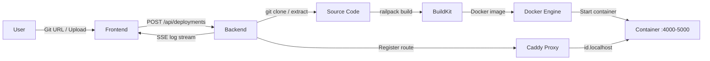

# 🚀 Brimble Deployer

A self-hosted deployment platform. Push code (via Git URL or file upload), and it builds, containerizes, and serves your app on a unique subdomain — all from a single `docker compose up`.

Think of it as a stripped-down Vercel/Railway you can run on your own machine.

---

## ✨ What It Does

- **Deploy from Git URL** — paste a repo link, hit deploy
- **Deploy from file upload** — drag in a `.zip` or `.tar.gz`
- **Auto-detect & build** — Railpack figures out your stack (Node, Python, Go, etc.) and builds a Docker image
- **Live subdomain routing** — each deployment gets `{id}.localhost`, managed at runtime via Caddy's Admin API
- **Real-time build logs** — streamed to the browser over SSE as the pipeline runs
- **Full lifecycle** — deploy, monitor status, view logs, tear down with one click

---

## 💡 Motivation

This started as a take-home for Brimble, but I intentionally over-engineered it into something I'd want on my own GitHub — a functional, self-hosted PaaS that actually builds, runs, and routes real apps end-to-end.

Not a mock. Not a UI prototype. The whole pipeline works.

---

## 🎬 Demo

<video src="frontend/public/brimblemp4.mp4" width="100%" controls></video>

> If the video doesn't render above, you can [watch it directly here](frontend/public/brimblemp4.mp4).

---

## 🏗️ Architecture



**The pipeline in plain English:**

1. User submits a Git URL or uploads an archive
2. Backend clones/extracts the source into a temp build directory
3. Railpack auto-detects the stack and builds a Docker image via BuildKit
4. A container starts on an allocated port (4000–5000 range)
5. Caddy gets a new reverse-proxy route injected at runtime → `{id}.localhost`
6. Build logs stream to the frontend in real-time over SSE
7. Temp build files are cleaned up, deployment is tracked in SQLite

---

## 🛠️ Tech Stack

| Layer | Technology | Why |
|---|---|---|
| **Frontend** | React Router v7, Vite, TailwindCSS v4, shadcn/ui, TanStack Query | Modern React with file-based routing and type-safe data fetching |
| **Backend** | Express 5, Bun runtime | Fast startup, native SQLite, TypeScript out of the box |
| **Database** | SQLite (bun:sqlite, WAL mode) | Zero config, single-file, no external DB to manage |
| **Build** | Railpack + BuildKit | Zero-config builder — auto-detects language/framework, Nix-based reproducible builds |
| **Containers** | Docker (Dockerode) | Industry standard container runtime, programmatic control via API |
| **Routing** | Caddy (Admin API) | Dynamic route injection at runtime without restarts or config reloads |
| **Real-time** | Server-Sent Events (SSE) | Simpler than WebSockets for unidirectional log streaming, native browser support |
| **Orchestration** | Docker Compose | Single command to spin up the entire stack |

---

## 🚀 Usage

### Prerequisites

- **Docker** and **Docker Compose** installed
- Ports **80** and **3001** available

### Run

```bash
# Clone the repo
git clone https://github.com/IbrahimIjai/brimble-takehome-fullstack-eng.git
cd brimble-takehome-fullstack-eng

# Start everything
docker compose up --build
```

That's it. The entire stack — frontend, backend, Caddy, BuildKit — comes up together.

| Service | URL |
|---|---|
| **Frontend (UI)** | [http://localhost](http://localhost) (port 80) |
| **Backend API** | [http://localhost:3001](http://localhost:3001) |
| **Health Check** | [http://localhost:3001/health](http://localhost:3001/health) |
| **Deployed Apps** | `http://{deployment-id}.localhost` |

### Deploy an App

1. Open [http://localhost](http://localhost)
2. Paste a Git URL (e.g. `https://github.com/user/node-app`) **or** upload a `.zip`/`.tar.gz`
3. Click **Deploy Service**
4. Watch the build logs stream in real-time
5. Once running, click **Visit** to open the app at its subdomain

### Tear Down

```bash
docker compose down -v   # stops everything + removes volumes
```

---

## 🧠 Design Decisions

| Decision | Reasoning |
|---|---|
| **SSE over WebSockets** | Logs are unidirectional (server → client). SSE is simpler, no library needed, works with native `EventSource` |
| **Caddy Admin API over config reloads** | Routes are injected/removed at runtime via HTTP — no file writes, no service restarts |
| **SQLite over Postgres** | Single-node platform, zero external dependencies, WAL mode gives good concurrent read performance |
| **Railpack over raw Dockerfiles** | Users shouldn't need to write Dockerfiles. Railpack auto-detects the stack and builds optimized images |
| **Port range allocation (4000–5000)** | Simple, predictable, avoids conflicts. In-memory set tracks used ports, recovered from DB on restart |
| **BuildKit as a sidecar** | Separates image building from the app container. Enables build caching and parallel builds |

---

## 🔮 What I'd Build Next

- **GitHub Webhooks** — auto-deploy on push to main
- **Custom domains** — map `myapp.com` to a deployment via Caddy
- **Health checks** — auto-restart unhealthy containers
- **Build caching** — persist Railpack/BuildKit layers across deploys
- **Auth & multi-tenancy** — user accounts, project isolation
- **Horizontal scaling** — Kubernetes/Nomad for multi-node deployments
- **Rollbacks** — keep previous image versions, one-click rollback

---

## 📁 Project Structure

```
.
├── backend/
│   └── src/
│       ├── index.ts              # Express server entry
│       ├── routes/deployments.ts # REST API (CRUD + log streaming)
│       ├── pipeline/
│       │   ├── pipeline.ts       # Clone → Build → Deploy orchestration
│       │   ├── caddy.ts          # Caddy Admin API integration
│       │   └── ports.ts          # Dynamic port allocator
│       ├── db/db.ts              # SQLite schema + queries
│       └── sse/sse.ts            # SSE broadcast manager
├── frontend/
│   └── app/
│       ├── routes/home.tsx       # Main dashboard page
│       ├── components/           # DeploymentCard, Form, LogViewer, StatusBadge
│       ├── hooks/useLogStream.ts # SSE hook for real-time logs
│       └── lib/api.ts            # API client
├── caddy/Caddyfile               # Reverse proxy config
└── docker-compose.yml            # Full stack orchestration
```

---

## 📝 API Reference

| Method | Endpoint | Description |
|---|---|---|
| `POST` | `/api/deployments` | Create a deployment (git URL or file upload) |
| `GET` | `/api/deployments` | List all deployments |
| `GET` | `/api/deployments/:id` | Get a single deployment |
| `GET` | `/api/deployments/:id/logs` | Get build logs |
| `GET` | `/api/deployments/:id/logs/stream` | SSE stream of build logs |
| `DELETE` | `/api/deployments/:id` | Stop and remove a deployment |
| `GET` | `/health` | Health check |
